> ## Building Our Own Cryptocurrency governed by Smart Contract

> ## Test Cases Sceenshots

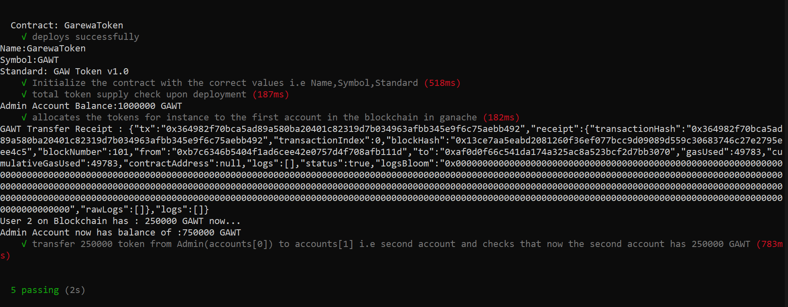

- [x] Initializing Name,symbol,standard
- [x] allocating coin to the Admin/first account in blockchain
- [x] transferring 250000 from Admin(user[0]) to the other user[1] Account on the Blockchain.

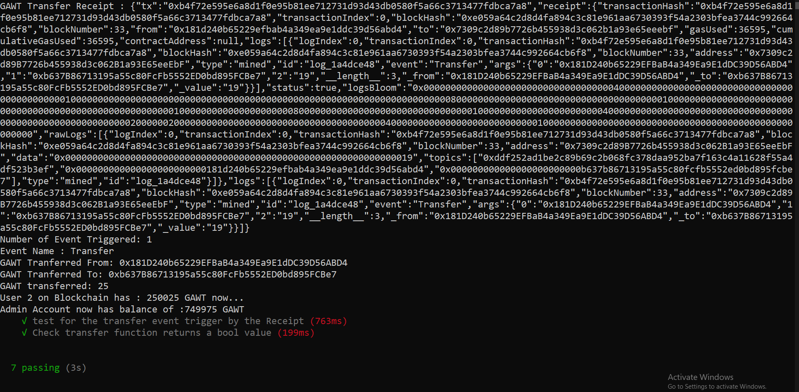

- [x] test transfer event triggering or not when transfer of token function executes.
- [x] test that transfer function returns true if transfer goes right.

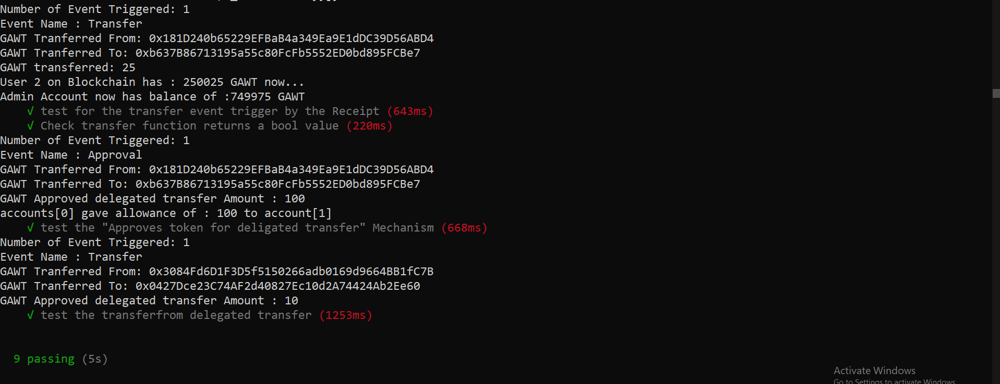

- [x] Approval and allowance check
- [x] Delegated transfer check (transferFrom)

> ## Truffle Console debugging

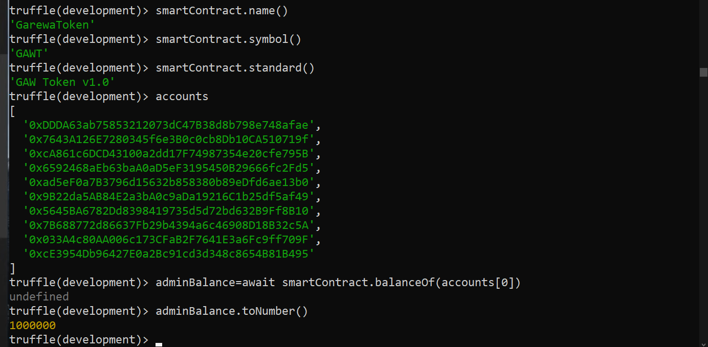

- [x] name,symbol,standard checks
- [x] addresses on the blockchain
- [x] balance check on the admin i.e accounts[0]

> #### Transfer 2 tokens from admin(account[0]) to receiver(account[1]) and Transfer event in logs

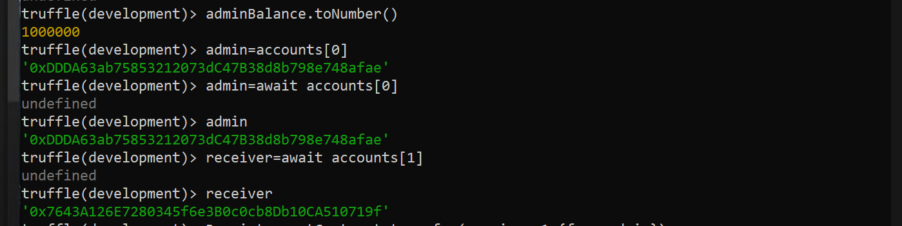

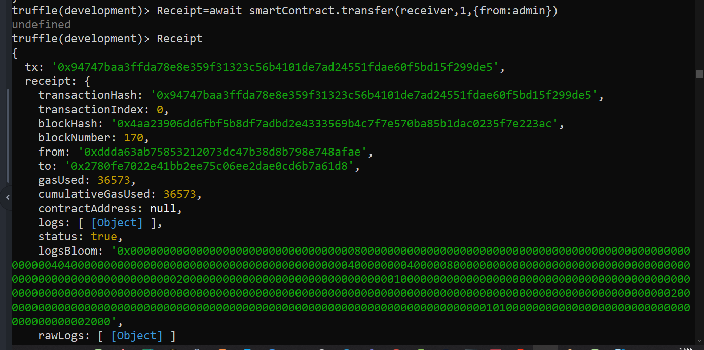

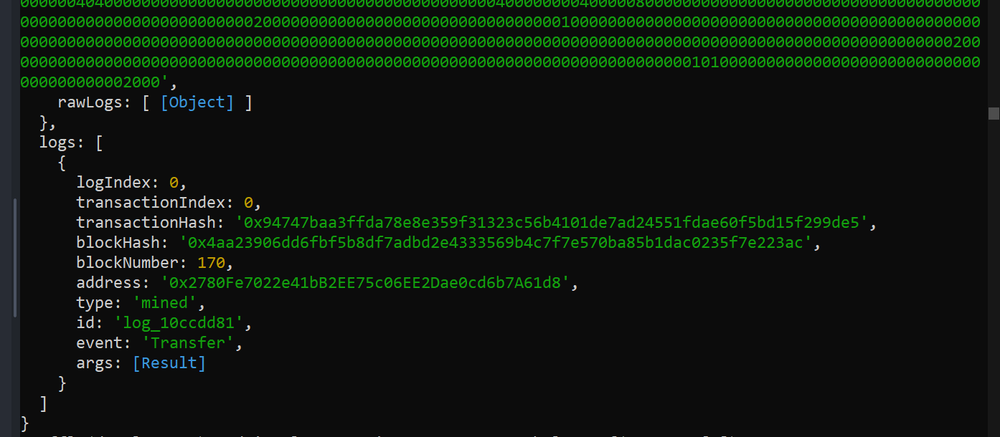

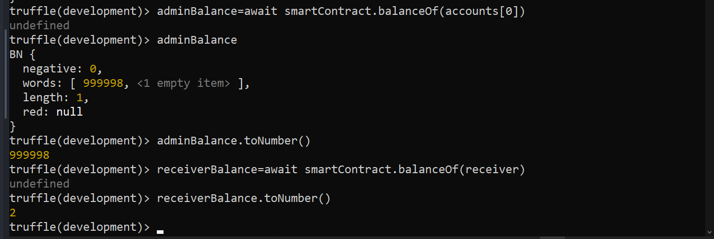

> #### Approve and Approval event

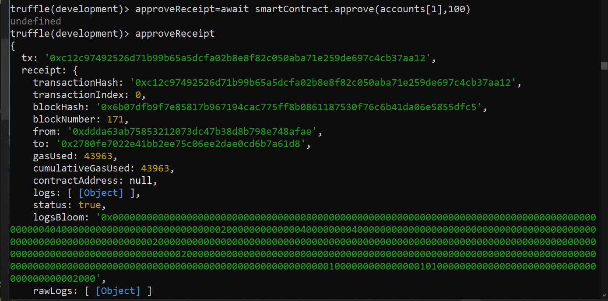

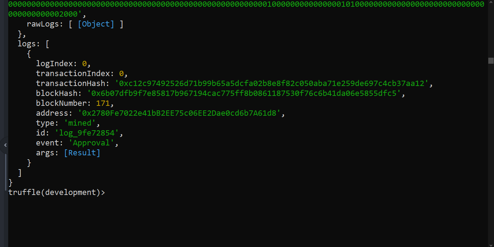

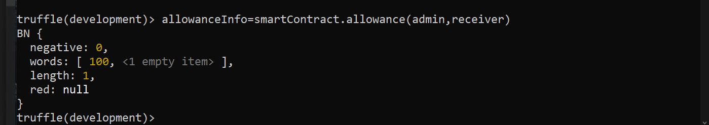

> #### Delegated Transfer check console

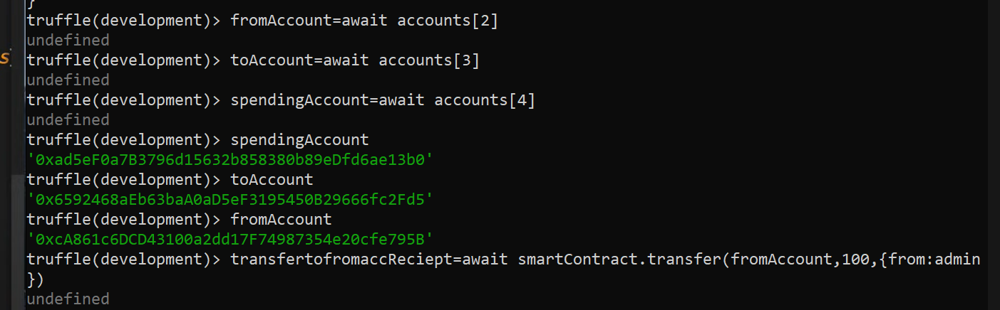

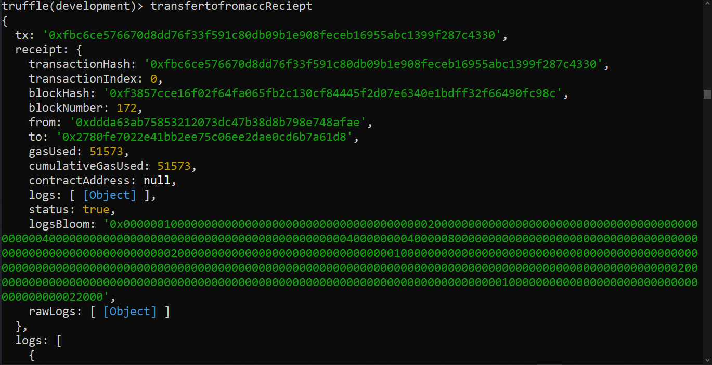

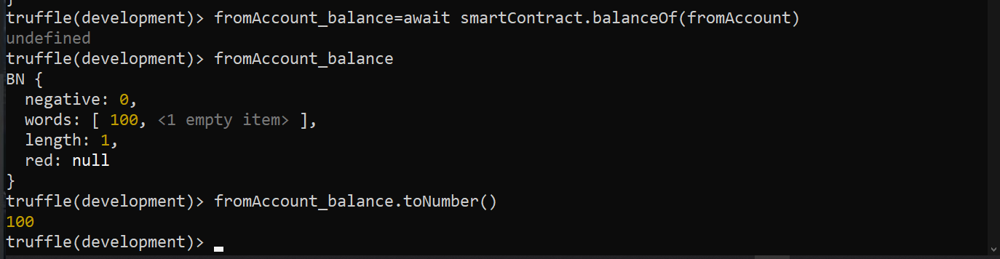

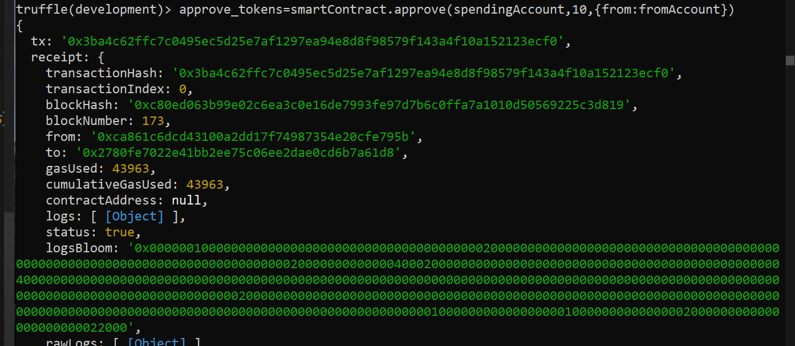

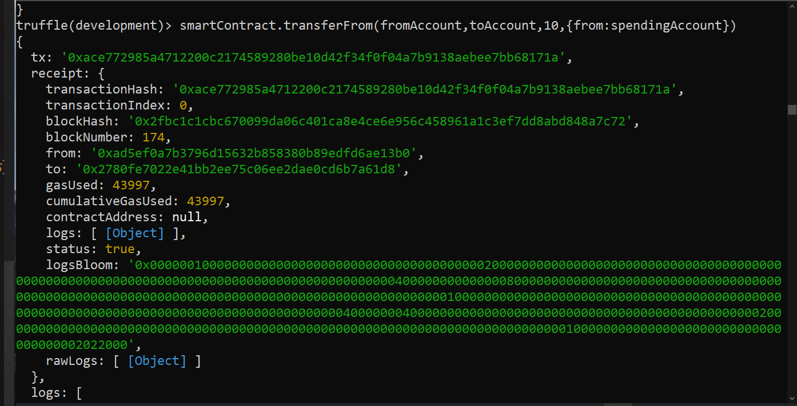

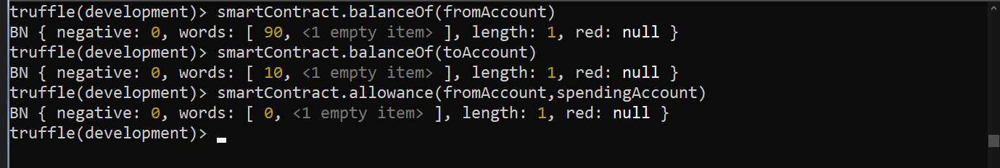

- [x] the fromAccount which had 100 now has 90
- [x] the toAccount got 10
- [x] and the allowance which was 10 is now set back to 0 after 10 token transferFrom(delegated transfer was successfull).

> ## Issues
- [ ] causes VM exception issues while processing transaction updating allowance.

> ## Blueprint/Steps

- [x] truffle init in the empty project directory
   - [x] folders contracts,migrations,test,truffle-config.js
   - [x] set up the truffle-config.js
- [x] write your token Smart contract(GarewaToken.sol) ****This Will implement the ERC-20 standard based token****
    - [x] test out wheather everything is set up correctly by writing a 2_ migrations file and then compiling the code.
    - [x] make sure ganache is running
    - [x] truffle migrate if first time
    - [x] truffle migrate --reset each time u make changes in SC
    - [x] Write first test,compile,migrate --reset then truffle test
    - [x] If above steps completed then Basic bolierplate Setup Done
***
***

> ### Aim -

- [x] ****To understand ERC-20 token standard.****

- [x] ****Build own cryptocurrency.****

- [x] ****deploy in test environement with fake ether and Rinkeby Test Network to simulate how a cryptocurrency works in realtime.****

- [x] ****And Simulating an ICO initial coin offering mechanism , In an ICO, a quantity of cryptocurrency is sold in the form of "tokens" ("coins") to speculators or investors, in exchange for legal tender or other (generally established and more stable) cryptocurrencies such as Bitcoin or Ethereum. The tokens are promoted as future functional units of currency if or when the ICO's funding goal is met and the project successfully launches****

***

> ## Understanding ERC-20 token/API standards
refer :https://github.com/ethereum/EIPs/blob/master/EIPS/eip-20.md
https://ethereum.org/en/developers/docs/standards/tokens/erc-20/

- ****An API specification/standard how a cruptocurrency must be built****

- ****It defines what methods,protocols,standards need to be followed while coding your own cryptocurrency****

- ****it makes the token to be compliant , so that it can bought or sold this token and is accepted widely/globally****

> #### Methods

- OPTIONAL

  - name ****function name() public view returns (string)****
  - symbol ****function symbol() public view returns (string)****
  - decimals (Returns the number of decimals the token uses ) ****function decimals() public view returns (uint8)****

- REQUIRED

  - totalSupply (returns the total token supply) ****function - totalSupply() public view returns (uint256)****
  - balanceOf (returns account balance of the account with address) ****function balanceOf(address _owner) public view returns (uint256 balance)****
  - transfer (Transfers _value amount of tokens to address _to, and MUST fire the Transfer event. The function SHOULD throw if the message caller's account balance does not have enough tokens to spend.) ****function transfer(address _to, uint256 _value) public returns (bool success)****

  Note Transfers of 0 values MUST be treated as normal transfers and fire the Transfer event.

  - transferFrom ****function transferFrom(address _from, address _to, uint256 _value) public returns (bool success)****

  - approve ****function approve(address _spender, uint256 _value) public returns (bool success)****

  - allowance ****function allowance(address _owner, address _spender) public view returns (uint256 remaining)****

> #### EVENTS

- Transfer ****event Transfer(address indexed _from, address indexed _to, uint256 _value)****
- Approval ****event Approval(address indexed _owner, address indexed _spender, uint256 _value)****

> #### Implementations

- OpenZeppelin implementation
- ConsenSys implementation

timestamp-3642
SRC: https://www.dappuniversity.com/articles/code-your-own-cryptocurrency-on-ethereum
